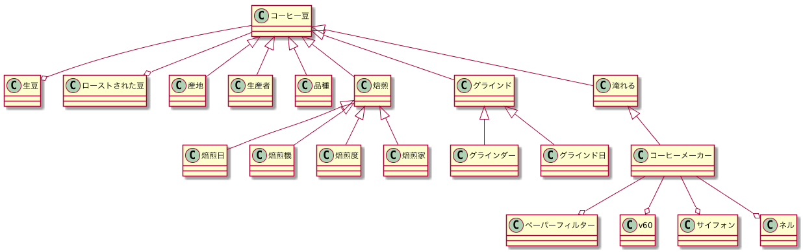

| 名前  | Name | 説明 |
|:-----:|:----:|:-----|
| コーヒー豆 | CoffeeBean |  |
| 生豆 | GreenCoffeeBean |  |
| ローストされた豆 | RoastedCoffeeBean | コーヒー豆と一緒で良いのではないか？ |
| 産地 |  | 生産国とマージ |
| 生産者 |  |  |
| 品種 |  |  |
| 焙煎 | Roast |  |
| 焙煎機 | Roaster |  |
| 焙煎日 |  |  |
| 焙煎度 |  |  |
| 焙煎家 |  |  |
| グラインド | Grinde | 挽くとマージ |
| グラインダー | Grinder |  |
| グラインド日 |  |  |
| 粗さ |  |  |
| 抽出 | Extract |  |
| 淹れる |  |  |
| コーヒーメーカー | CoffeeMachine | コーヒーの抽出器具 |
| ペーパーフィルター | Paper |  |
| v60 |  |  |
| サイフォン |  |  |
| ネル |  |  |
| 飲み方 |  |  |
| アイスコーヒー |  |  |
| カフェラテ |  |  |
| カプチーノ |  |  |
| エスプレッソ |  |  |
| 相性 |  |  |
| ミルク入り |  |  |
| 砂糖入り |  |  |
| テイスティング | Tasting |  |
| 水分量 |  |  |
| 香り |  |  |
| 酸味 |  |  |
| コク |  |  |
| 風味 |  |  |
| 味 |  |  |
| キャニスター | Canister |  |
| 保管方法 |  |  |
| 分量 |  |  |
| コーヒーショップ |  |  |
| カフェ |  |  |
| ショップ住所 |  |  |
| ショップ電話番号 |  |  |
| 賞味期限 |  |  |
| アラート |  |  |
| 豆の登録 |  |  |
| 飲み方の記録 |  |  |
| ショップの記録 |  |  |
| テイスティングへの評価 |  |  |
| テイスティングノート |  |  |
| 共有 |  |  |
| 工程 |  |  |
