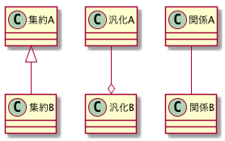
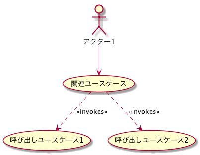
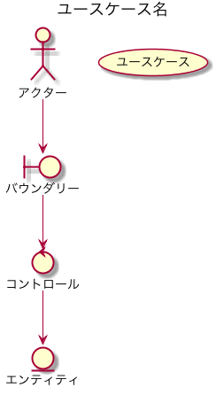

# ドメイン駆動開発

- [ユースケース駆動開発ガイド](https://www.amazon.co.jp/%E3%83%A6%E3%83%BC%E3%82%B9%E3%82%B1%E3%83%BC%E3%82%B9%E9%A7%86%E5%8B%95%E9%96%8B%E7%99%BA%E5%AE%9F%E8%B7%B5%E3%82%AC%E3%82%A4%E3%83%89-OOP-Foundations-%E3%83%80%E3%82%B0%E3%83%BB%E3%83%AD%E3%83%BC%E3%82%BC%E3%83%B3%E3%83%90%E3%83%BC%E3%82%B0/dp/4798114456/ref=sr_1_1?ie=UTF8&qid=1552200934&sr=8-1&keywords=%E3%83%A6%E3%83%BC%E3%82%B9%E3%82%B1%E3%83%BC%E3%82%B9%E9%A7%86%E5%8B%95)
- [ICONIXプロセス](http://d.hatena.ne.jp/shuji_w6e/20081116/1226853215)

## ガイドライン

### ドメインモデル記述のガイドライン

- 10.現実世界（問題領域）のオブジェクトに焦点を合わせなさい。
- 9.オブジェクト同士の関係を表現するため、汎化（is-a）関係および集約（has-a）関係を利用しなさい。
- 8.最初のドメインモデリングにかける時間は2 時間に限定しなさい。
- 7.問題領域中の主要な概念を中心にクラスを構成しなさい。
- 6.ドメインモデルをデータモデルと勘違いしてはいけません。
- 5.オブジェクト（単一のインスタンスを表現する存在）とデータベースのテーブル（モノの集合を含む存在）とを混同してはいけません。
- 4.ドメインモデルをプロジェクトの用語集として使いなさい。
- 3.名前が曖昧になることを避けるため、ユースケースを書く前にドメインモデルを書きなさい。
- 2.最終的なクラス図が、ドメインモデルと正確に合致することを期待してはいけません。しかしこの2つは、何らかの形で相似の関係にあるはずです。
- 1.ドメインモデルには、画面やその他のGUI 固有の部品クラスを配置してはいけませ

### ユースケース記述のガイドライン

- 10.2段落ルールに従いなさい。
- 9.アクターとユースケース図を使ってユースケースを組織化しなさい。
- 8.ユースケースは叙述的に書きなさい。
- 7.イベントとその応答の流れとしてユースケースを書き、ユーザーとシステムの対話の両側を記述しなさい。
- 6.GUI プロトタイプや画面モックアップを使いなさい。
- 5.ユースケースは実行時の振る舞いの仕様であるということを忘れないように。
- 4.オブジェクトモデルの言葉を使ってユースケースを書きなさい。
- 3.「名詞－名詞－動詞」という文の構造に従ってユースケースを書きなさい。
- 2.ドメインクラスの名前を使いなさい。
- 1.（画面のような）バウンダリクラスの名前を使い

### ロバストネス図とは

ロバストネス図は、ユースケースに示された振る舞いを図式化したものであり、参加するクラスとソフトウェアの振る舞いの両方を示していますが、どの振る舞いがどのクラスの責務となるかはあえて示していない。

ロバストネス図における動作の流れと、ユースケース記述で説明されたステップの間には、1対1の直接の相関関係があります。
以下の関連するオブジェクト間を、線（コントローラーを挟む）によってつなげることで表現します。

- バウンダリオブジェクト ―― システムと外部世界との「インターフェイス 」。
    - ※バウンダリオブジェクトは通常、画面かWebページ （すなわち 、アクターと対話するプレゼンテーション層 ）となる 。
- エンティティオブジェクト ―― ドメインモデル上のクラス。
- コントローラ ―― バウンダリオブジェクトとエンティティオブジェクトの間の「接着剤」 。

### ロバストネス図を書く際の規則

バウンダリオブジェクトとエンティティオブジェクトは名詞 、コントローラは動詞だと考えた場合にロバストネス図を描くときは、以下の規則を使用する。

- 名詞は動詞とつなぐことができる（逆もまた同様 ）。
- 名詞をほかの名詞につなぐことはできない。
- 動詞はほかの動詞とつなぐことができる。

「名詞－動詞(*n)－名詞 」の形式でユースケース記述を確実にパターン化できます。

### ロバストネス分析のガイドライン

- 10.ユースケース記述をロバストネス図に直接貼り付けなさい。
- 9.ドメインモデルからエンティティクラスを取り出し、不足しているものがあれば追加しなさい。
- 8.ロバストネス図の作成中にも、ユースケース記述を書き直して明確にすることがあります。
- 7.画面単位にバウンダリオブジェクトを作成し、明確な画面名を付けてください。
- 6.コントローラは、本物のコントロールオブジェクトになることがあるかもしれないということを忘れないでください。これらは通常、論理的なソフトウェア機能にすぎません。
- 5.ロバストネス図上の矢印の方向について気にしてはいけません。
- 4.親のユースケースから起動されるのであれば、ユースケースをロバストネス図上にドラッグしてもかまいません。
- 3.ロバストネス図はユースケースに対する予備的な概念設計を示しています。文字どおりの詳細設計ではありません。
- 2.一般的に、ロバストネス図上のバウンダリオブジェクトとエンティティクラスはシーケンス図上のオブジェクトインスタンスとなります。一方、コントローラはシーケンス図上のメッセージとなります 。
- 1.ロバストネス図はユースケースの「オブジェクトの絵」であるということを忘れないでください。その目的はユースケース記述とオブジェクトモデルの両方を強制的に洗練させることです。

# Wikiに関わる部分のPlantUML

- [PlantUML](http://plantuml.com/ja/index)
- [Cheat Sheet](https://qiita.com/ogomr/items/0b5c4de7f38fd1482a48)

## ドメイン図

```
@startuml
集約A <|-- 集約B
汎化A --o 汎化B
関係A -- 関係B
@enduml
```



## ユースケース図

```
@startuml

actor アクター1

アクター1 --> (関連ユースケース)
(関連ユースケース) ..> (呼び出しユースケース1) : <<invokes>>
(関連ユースケース) ..> (呼び出しユースケース2) : <<invokes>>

@enduml
```



## ロバストネス図

```
@startuml

title ユースケース名
' ロバストネス図にするために、ユースケースとして表示しておく
(ユースケース名)

' アクター一覧
actor アクター

/'
  名詞
  バウンダリー一覧
  エンティティ一覧
'/
boundary バウンダリー
entity エンティティ

/'
  動詞
  コントロール一覧
'/
control コントロール

' 参照ユースケース一覧
usecase ユースケース

アクター --> バウンダリー
バウンダリー --> コントロール
コントロール --> エンティティ

@enduml
```


